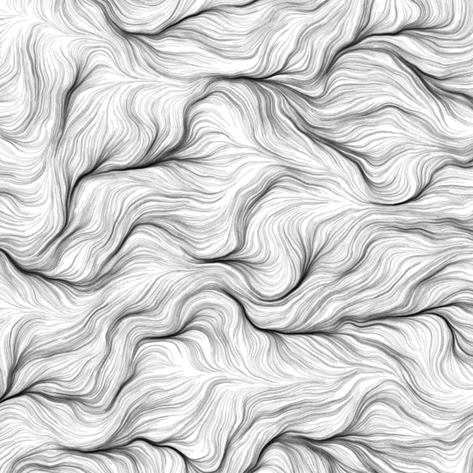
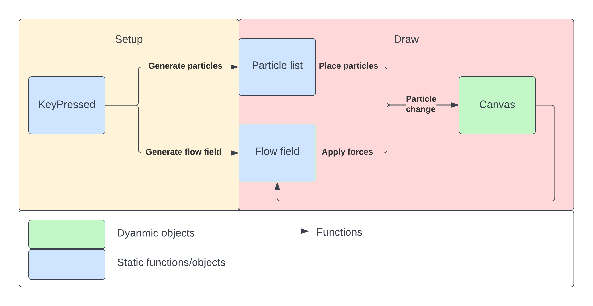

# Assignment 6
For assignment 6, we will be making a set of three simulations that show case particle physics at different ranges. The simulations will be able to be toggled between each other using the number keys. Our planned simulations are based in 2D processing.

# Simulation 1: Solar System
(Yawer's)
# Simulation 2: Perlin Noise with Masses

The second simulation will feature particles moving across the screen through a perlin noise based vector field to create art and flow fields. Every time the simulation is reinitialized, the flow field will regenerate and the particles will redraw the piece of art to ensure each time the art is unique. For full transparency, perlin noise flow fields have been done before by many people. To ensure this code is unique, the particles that draw the flow field will also have `randomGaussain()` generated masses which will affect the speed and the overall drawing.

# Simulation 3:
The third stimulation will feature particles moving across the screen and act as fireworks.  The simulation will keep producing fireworks either by mouse clicks or continuously generated.  The two forces/rules that will guide object behavior are gravity and the initial explosion force. I think the initial explosion force will be randomly generated to help create fireworks with different heights and sizes. The colors of the fireworks will also be randomly generated to create a more authentic look. Each firework will be a collection of individual particles with each particle having its own attributes.
